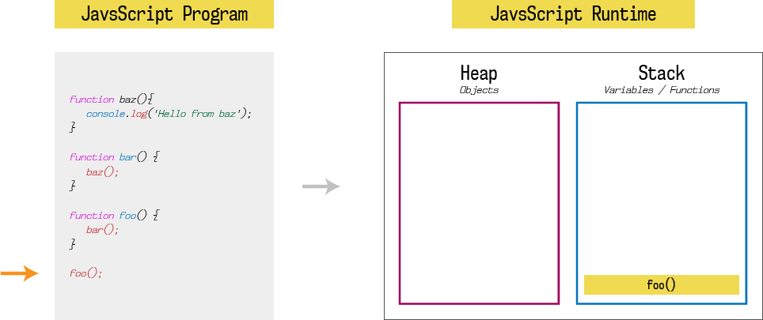

# Asinxron (asynchronous)

### JS Single Thread və Synchronous dildir.

🆘 Thread - Bir iş sırasında görülən iş parçasıdır. Yəni iş zamanında çalışan bir iş parçası. Beləliklə Javascript bir single thread dildir. Çünki bir səfərdə bir kod parçasını işə salır. Aşağıda Javascriptin çalışma anının (Runtime) bəsitləşdirilmiş görüntüsü qeyd olunub.

### Call stack nədir ⁉
👁‍🗨 Call stack - sadəcə olaraq proqramda olduğumuz yeri qeyd edən məlumat strukturudur. İndi gəlin işlərin yavaşladığı nöqtəyə gələk, əgər biz bir anda bir kod parçasını işlədə biliriksə, sonradan çağırılacaq funksiyalar icra olunmazdan əvvəl, öncədən çağırılan funksiyaların bitməsini gözləməliyik. Əgər kodumuz yalnız console.log və ya digər sadə əməliyyatlardan ibarətdirsə, bu problem olmaya bilər, lakin təsvirin emalı (image processing) və ya şəbəkə sorğuları (network queries) çox vaxt apara bilər. Yəni bu problem yaradar mı? Əlbəttə! Kodumuzu brauzerdə işlətdiyimiz üçün və Call stack boş olmadığı müddətcə brauzerdə edəcəyimiz heç bir şey işlənməyəcək, brauzer sözün əsl mənasında donacaq.
