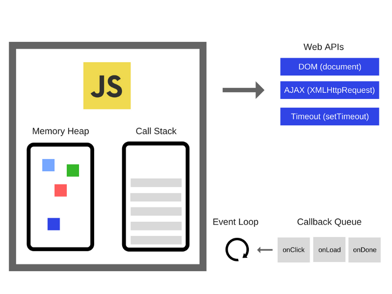
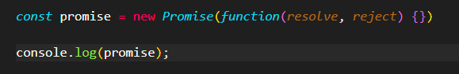
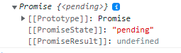
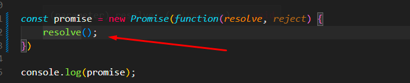
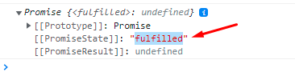
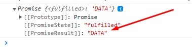

# Asinxron (asynchronous) [Source](./app.js)

### JS Single Thread və Synchronous dildir.

🆘 Thread - Bir iş sırasında görülən iş parçasıdır. Yəni iş zamanında çalışan bir iş parçası. Beləliklə Javascript bir single thread dildir. Çünki bir səfərdə bir kod parçasını işə salır. Aşağıda Javascriptin çalışma anının (Runtime) bəsitləşdirilmiş görüntüsü qeyd olunub.


### Asinxron və Sinxron nədir ⁉
👁‍🗨 Təsəvvür edək ki, bir restorana gedirik və sifariş veririk. Bizim kimi sifariş verən bir neçə nəfər də var. Amma restoran hərkəsə birdən xidmət göstərir. Yəni restoranın iş prinsipi bu deyil: 
⛔ "Bu müştəriyə tam xidmət göstərim yola salım, ona qədər bütün yeni müştərilər gözləsinlər, yola saldıqdan sonra isə gözləyənlərin birincisini seçim ona xidmət göstərim." 
✅ Restoran hərkəsə birdən xidmət göstərir. Bu asinxron çalışmadır. Yuxarıdaki iş prinsipi isə sinxron çalışmadır. Javascript kodları müəyyən ardıcıllıqla işə saldığı üçün sinxron prinsipə sahibdir. Yəni 4 sətir kod var, 2 ci sətirdə bir gecikmə yaşansa gecikmə həll olunana qədər gözlənilir. Amma asinxron iş prinsipi 2 ci sətiri gözləməz (ətraflı aşağıda qeyd olunub) digər sətirlərə keçər və sonda 2 ci sətiri çalışdırar.

### Sinxron
#### Örnək 1:
```
const func1 = () => {
    console.log('Birinci kod');
    console.log('İkinci kod');
    alert('Üçüncü kod');
    func2();
}

const func2 = () => {
    console.log('Dördüncü kod');
}
```

Yuxarıdakı proqramda func1() çağrıldıqda konsol sətrində ardıcıllıq belə olur:
- Birinci kod
- İkinci kod
- ALERT: Üçüncü kod (Ok basmadıqca digər sətirə keçilmir)
- Ok basdıqdan sonra: Dördüncü sətir

Bəlkə mənim ürəyim OK'a basmaq istəmir?! Məcburam ki, OK basım? Demək basmasam proqram davam etməyəcək. Yaxşı ki, burda heç olmasa kontrol mənim əlimdədir. Bəs kontrol bizdə olmasaydı? Düşünün ki, bir məlumat çağırmışıq oturub yazdığımız kodun nazı ilə oynayırıq, dua edirik ki, tez gəlsin...
#### PROBLEM 1: Gecimə nəticəsində proqramımız yavaş çalışa və bloklana bilər.

#### Örnək 2:
```
let x = 10;
console.log('1. X: ', x);

setTimeout(() => {
    x += 5;
}, 1000)
console.log('2. X: ', x);

x += 5;
console.log('3. X: ', x);
```

Yuxarıdakı proqramda konsol sətrində ardıcıllıq belədir:
- 1. X: 10
- 2. X: 10
- 3. X: 15

setTimeout ilə 1 saniyə gecikməylə əlavə olunan 5 dəyəri sinxron iş prinsibi sayəsində nəzə alınmadı. Alınsaydı, X'in son dəyəri 20 olardı.

#### PROBLEM 2: Gecikmə nəticəsində internetdən çağırdığımız hər hansı məlumat gec gələ və proqramımız natamam sonlana bilər!

### Asinxron
Yaxşı bəs bayaqdan danışırıq ki, Javascript sinxron iş prinsibinə sahibdir. Bəs necə asinxron işləyə bilir? Unutmayaq ki, Javascript hər zaman sinxron işləyir. Ancaq biz, yazacağımız Javascript kodlarıyla JS Çalışma ortamının (JS Runtime) içində sanki eyni anda fərqli işləri görürmüş kimi Javascript kodunu manipulyasiya edə bilirik. Javascript asinxron çalışmalarda Callback, Promise və async await istifadə edir. İndi hazır olaq sehirli bir söz görəcik: CALL STACK 😎


### Call stack nədir ⁉
👁‍🗨 Call stack - sadəcə olaraq proqramda olduğumuz yeri qeyd edən məlumat strukturudur. İndi gəlin işlərin yavaşladığı nöqtəyə gələk, əgər biz bir anda bir kod parçasını işlədə biliriksə, sonradan çağırılacaq funksiyalar icra olunmazdan əvvəl, öncədən çağırılan funksiyaların bitməsini gözləməliyik. Əgər kodumuz yalnız console.log və ya digər sadə əməliyyatlardan ibarətdirsə, bu problem olmaya bilər, lakin təsvirin emalı (image processing) və ya şəbəkə sorğuları (network queries) çox vaxt apara bilər. Yəni bu problem yaradar mı? Əlbəttə! Kodumuzu brauzerdə işlətdiyimiz üçün və Call stack boş olmadığı müddətcə brauzerdə edəcəyimiz heç bir şey işlənməyəcək, brauzer sözün əsl mənasında donacaq. Bunun həll yolu Asinxron proqramlaşdırmadır 👌


### Biraz single thread
```
function firstFunc() {
    console.log('Birinci');
    secondFunc();
    console.log('Birinci təkrar');
}

function secondFunc() {
    console.log('İkinci');
    thirdFunc();
    console.log('İkinci təkrar');
}

function thirdFunc() {
    console.log('Üçüncü');
}

firstFunc()
    /*
    Nəticə:
    Birinci
    İkinci
    Üçüncü
    İkinci təkrar
    Birinci təkrar
    */
```
Yuxarıdakı kod sətrinə baxın. İndi məncə tam aydın oldu single thread nədir! :) Proqram sinxron olaraq firstFunc()'dan sətir-sətir işlənməyə başlandı və  secondFunc()'a çatanda getdi onun içindəkiləri oxumağa, ordan da thirdFunc()'u gördü getdi onu oxumağa, sonra qayıtdı secondFunc()'a və onu oxuyub bitirərək firstFunc()'a geri qayıdıb console.log('Birinci təkrar') sətrini işə saldı. Nəticə olaraq bir səfərdə bir iş görüldü. Bu funksiyalar call stack'da belə işləyirlər. 


### Event loop
Event loop JavaScript-in icrası və işləmə prosesinin əsas nüvələrindən biridir. Daha da açıqlayıcı formada desək Event loop JS kitabxanalarının ürəyidir. Onun əsas işi sonsuz döngə şəklində davamlı olaraq Callstack quyruğuna (Callstack queue) köçürülən funksiyaları müvafiq vaxt gəldikdə (adətən işləyən metod başa çatdıqda) Callstack'a atmaq və onları işə salmaqdır.

Aşağıdakı kod sətrinə baxaq:
```
function task(message) {
    let n = 1000000000;
    while (n > 0) {
        n--;
    }
    console.log(message);
}

console.log(1);

setTimeout(() => {
    console.log(2);
}, 1000);

console.log(3);
console.log(4);

task('Process completed!')
```
Ardıcıllıq belə olacaq:
1. 1
2. 3
3. 4
4. Process completed!
5. 2
Maraqlıdır? Demək burda nə olur: SetTimeout callback funksiya aldığı üçün və callback funksiayalar proqramda ən son çalışdığı üçün (Çünki callback funksiyalar callback quyruğuna göndərilir və müvafiq müddətdən sonra callstack'a ötürülür.) 1 saniyə keçsə belə task() funksiyasının bitməsini gözləyir (Bu bir neçə saniyə çəkir) və ekranda görünür. 

### PROMISE
Promise, asinxron əməliyyatın son nəticəsini təmsil edən javascript obyektidir.

;
;

#### PromiseState nədir, necə başa düşək?
Tutaq ki, RESTApi'dən və ya verilənlər bazasından eləcə də internetdən bir məlumat almaq istəyirik. Almamışdan əvvəl PromiseState'in dəyəri "Pending", PromiseResult'un dəyəri isə "undefined" olur. Yuxarıdaki şəkildə new Promise() - ilə yaradılan obyektə verilən iki parametrə baxaq. Resolve (həll etmək) və Reject (rədd etmək). İndi biraz da əvvələ qayıdıb Promise sözünə baxaq. Promise - söz vermək. Mmmm... Demək belə düşünə bilərik: Bizə hər hansı bir yerdən məlumat gətirərkən, gətiriləcəyinin və ya gətirilərkən yaranan xətanın haqqında məlumatı bizə göstərməyə söz verilir. Davam edək:

;
;

resolve(); yazıldığı zaman, PromiseState'in dəyərinin "fulfilled" (yerinə yetirildi (bəzən resolved də deyilir)) olduğunu görürük. Yəni uğurla nəticələndi. Amma PromiseResult hələ də undefined olaraq qalıb. Niyə? Çünki biz obyekti (new Promise) yaradarkən yazdığımız funksiya 2 parametr alır (Resolve və Reject) və bunlarda özləri bir funksiyadır amma biz o funskiyalara dəyər göndərmədik. Baş qarışdı bilirəm amma düzələcək səbirli olaq :) 

##### İndi resolve funksiyasına parametr verək: 

;
;

Demək resolve'ə göndərdiyimiz "Data" bizə PromiseResult ilə qayıtdı. Əlbəttə ki, biz məlumatlarımızı string şəklində almayacıq. İndi sadəcə səhnələşdiririk. 

##### İndi keçək digər dostumuza "REJECT"
 
