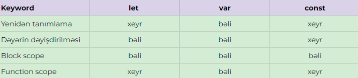

# Let const var

### Scope nədir ⁉
Scope: Dəyişkəni tanımladığımız yerə görə adlandırılır və dəyişkən bu ada sahib olur. Məsələn, Local scope'də tanımlanan dəyişkən local dəyişkəndir.

### Global scope
Javascript kodunda function/for/while/if/switch bloklarından başqa istənilən yerdə tanımlanan dəyişkənlərdir. Bu dəyişkənləri hər yerdən çağıra bilərik.

### Local scope
Sadəcə tanımlandığı yerdə çağrıla bilən dəyişkənlərdir. Kənardan bu dəyişkənləri çağıra bilmərik. 

```
let globalVar = 'Global dəyişkən';
console.log(globalVar); // global dəyişkən


function foo() {
    let localVar = "Local dəyişkən";
    console.log(localVar); // local dəyişkən
}
```

### Blok scope və Function scope nədir ⁉
ES6 ilə gələn let və const açar sözlərinin sahib olduğu scope anlayışlarıdır. Var function scope, let və const block scope özəlliyini daşıyır. Məsələn:
```
// global scope
function scope() {
  // function scope
  // local scope
  {
    // block scope
    // local scope
  }
}
```

### Let nədir ⁉
🆘 Let, ES6 ilə gələn Var alternatividir və block scope özəlliyi daşıyır. 

✅ Let ilə global olaraq tanımladığımız dəyişkənləri hər yerdə çağıra bilərik. Məsələn:
```
let planguages = ['js', 'c++', 'c#', 'php'];

function codeSchool() {
    console.log(pl);
}
codeSchool(); // Nəticə: ['js', 'c++', 'c#', 'php']
```

✅ Let, olduğu yerdəki { bəzəkli mötərizələr } arasında işlənə bilir. Məsələn:
```
function developing() {
    let course = 'javascript';
    console.log(course);
}
developing(); // Nəticə: javascript
```

✅ Let ilə bir tanımlanan dəyişkənin dəyəri dəyişdirilə bilər. Məsələn:
```
let book = 'The call of the wild';
console.log(book); // Nəticə: The call of the wild
book = 'Robin Hood';
console.log(book); // Nəticə: Robin Hood
```

⛔ Bir funksiyanın içində let ilə bir dəyişkən tanımlasaq onu funksiyanın çölündə çağıra bilmərik. Məsələn:
```
function person() {
    let fullName = 'Hikmat Rajabli';
}
console.log(fullName); // Nəticə: fullName is not defined
```

⛔ Let ilə tanımlamış olduğumuz dəyişkəni yenidən tanımlaya bilmərik. Məsələn:
```
let personName = 'Samir';
let personName; // Nəticə: Identifier 'personName' has already been declared
```

### Var nədir ⁉
🆘 Var function scope özəlliyini daşıyır. ES6 versiyasına qədər dəyişkən tanımlamaq üçün sadəcə Var istifadə olunurdu. Var function scope özəlliyi daşıdığı üçün özü ilə bir sıra təhlükəsizlik problemləri gətirirdi. Const və Let gəlişindən sonra bu təhlükəsizlik problemləri öz həllini tapdı. Yuxarıdakı Let üçün olan qaydalar aşağıdakı fərqləri çıxmaq şərtilə Var üçün də eynidir.

✅ Var ilə if/for bloku içində tanımlamış olduğumuz dəyişkəni kənarda çağıra bilərik. Məsələn:
```
var x = 0;
if (x == 0) {
    var y = 12;
}
console.log(y); // Nəticə: 12
```

✅ Var ilə tanımlamış olduğumuz dəyişkəni yenidən tanımlaya bilərik. Məsələn:
```
var job = 'front-end developer';
var job = 'back-end developer';
// console.log(job); // Nəticə: back-end developer
```

👁‍🗨 Let və Var fərqinə aid qısa örnək: 
```
// VAR:
var a = 1;
console.log(a); // Nəticə: 1

if (a == 1) {
    var a = 10;
    console.log(a); // Nəticə: 10
}

console.log(a); // Nəticə: 10

// *****

// LET:
let b = 1;
console.log(b); // Nəticə: 1

if (b == 1) {
    let b = 10;
    console.log(b); // Nəticə: 10
}

console.log(b); // Nəticə: 1
```

### Const nədir ⁉
🆘 ES6 ilə gələn dəyişkən tanımlamaq üçün istifadə olunan açar sözdür və block scope özəlliyi daşıyır. "Constant" kəliməsinin qısaltmasıdır və mənası "sabit" deməkdir. Yuxarıdakı Let üçün olan qaydalar aşağıdakı fərqləri çıxmaq şərtilə Const üçün də eynidir.

⛔ Const ilə tanımlanan dəyişkənlərin dəyərləri dəyişdirə bilməz.
```
const myAge = 22;
console.log(myAge);

myAge = 23;
console.log(myAge) // Assignment to constant variable;
```
✅ Const massiv və siniflərdə (array, class) fərqli davranır. Bu halda const dəyişənin dəyərini deyildə dəyişənin tutduğu yeri özündə saxlayır. Ona görə də dəyəri dəyişmək mümkün olur. Məsələn: 

```
const myArr = [1, 2, 3, 4];
myArr.pop();
// console.log(myArr); // Nəticə: [1, 2, 3]
```


✅ Proyektlərdə hər zaman const let və var-dan daha çox istifadə olunur. Bunun başlıca səbəbləri isə təhlükəsizlik və kod oxunaqlığıdır. 

👁‍🗨 Let - const - var qarşılaşdırması


