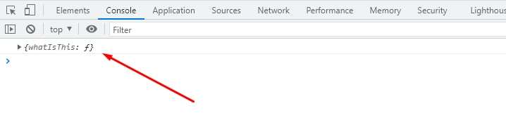

# Obyekt 1 HİSSƏ

### Obyekt nədir ⁉
Obyekt, property və value (özəllik və dəyər)'dən ibarət data tipidir. Aşağıda Person obyektindəki name, surname, age, birthOfYear, shortInfo obyektin property, qarşılarındakı isə dəyərləridir:
```
const Person = {
    name: 'Hikmat',
    surname: 'Rajabli',
    age: 22,
    birthOfYear: function() {
        return 22 - this.age;
    },
    shortInfo: function() {
        return `Hi, I'm ${this.name} ${this.surname}`;
    }
}
```

🆘 Yuxarıdakı örnəkdə birthOfYear və shortInfo bir özəllikdir dedik. Amma ümumi olaraq obyekt içindəki funksiyalara metod deyilir. 

### This nədir ⁉

This yazıldığı yerdə hansı data tipinin içinə yazılıbsa, o data tipinin hansı data tipinin içində olduğunu göstərir. Bilirəm başınız qarışdı. Ona görə də keçək örnəklərə. 
```
const myThis = {
    whatIsThis: function() { return this }
    console.log(myThis.whatIsThis()) // => {whatIsThis: ƒ}
}
```
Yuxarıdakı örnəkdə myThis obyektinin içindəki whatIsThis metodunda this return (geriyə döndürmə) edilib. İndi mərhələ-mərhələ davam edək:
1. This yazıldığı yerdə hansı data tipinin içinə yazılıbsa => this whatIsThis metodunun içinə yazılıb
2. O data tipinin hansı data tipinin içində olduğunu göstərir => whatIsThis metodu, myThis obyektinin içinə yazılıb.
Demək, console.log(myThis.whatIsThis()) => bizə nə verəcək? Təbii ki, myThis obyektini!



### Nə üçün bir obyektə ehtiyac duyarıq ⁉
Əgər istəsək yuxarıdakı örənkələrdəki özəllikləri ayrı-ayrı da qlobal dəyişkən olaraq (let name = 'hikmat') tanımlaya bilərdik. Amma obyekt məntiqi sayəsində onların hamsını bir obyektdə saxlayırıq. Bu həm təmiz kod yazmağa zəmin yaradır həm də bütün işləri bir obyekt üzərindən aparmağımıza imkan verir. 

### Object Literal, Constructor function, Dot Notation, Bracket Notation

Yuxarıdaki obyekt yaratma yolları **Object Literal** adlanır. Yəni:
```
const Person = {
    name: 'Hikmat',
    surname: 'Rajabli',
    age: 22,
    birthOfYear: function() {
        return 22 - this.age;
    },
    shortInfo: function() {
        return `Hi, I'm ${this.name} ${this.surname}`;
    },
}
```
🆘 **Object Literal**'da dəyərlər hazır gəlməlidir. Sonradan dəyər dəyişdirmək və ya özəllik əlavə etmək mümkündür. Bunları etmək üçün Dot Notation və Bracket Notation istifadə edirik. Narahat olmayın, bildiyiniz şeylərdir. 

1. Dot Notation: console.log(Person.name)
2. Dot Notation Person.name = 'Ramin'
3. Bracket Notation: console.log(Person['name'])
4. Person['newProperty'] = 'This is new Property'

🆘 **Constructor Function** vasitəsilə obyekt yarada bilərik. Qurucu funksiyalar (constructor) sayəsində hər dəfəsində yeni obyektlər yarada bilərik. Məsələn:
```
Ardı var...
```